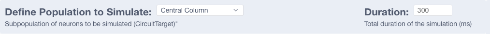
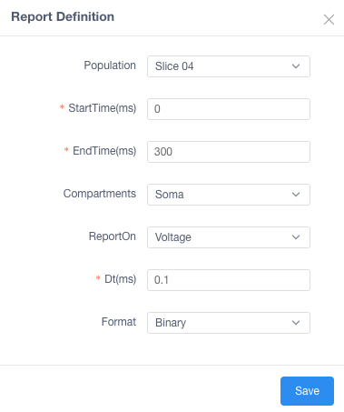
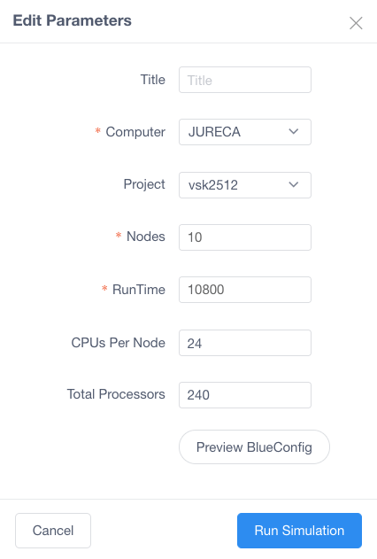
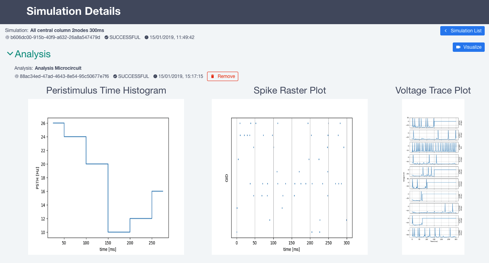

# Steps to run a sample simulation of Rat CA1 microcircuit for MOOC II

## Launch Simulation
Go to [Simulation-Launcher-UI](https://bbp.epfl.ch/public/simulationapp/index.html#/circuits/hippo_mooc_sa_microcircuit)

Full documentation [Github](https://github.com/lbologna/hbp-sp6-guidebook/blob/master/source/online_usecases/brain_area_circuit_in_silico_experiments/hippocampus/configure_run_brainregion_preconf_model_data/configure_run_brainregion_preconf_model_data.rst)

#### Define simulation general parameters:
In this section we will define some parameters for the simulation.

  

#### Define stimulation(s):
In this section we will define the stimulation that we want to apply and in which region(s) this will be applied.

- Add a new stimulus or edit the existing one double clicking on the item
- A new window will pop-up and it should looks like the one below (in case of question please check the full doucmentation mentioned above)

  

#### Define report(s):
In this section we will define the reports that we want to obtain from the simulation We need to specify from which population we want to obtain the data from.

- To add, remove, edit same as above.
- A new window will pop-up and it should looks like the one below (in case of question please check the full doucmentation mentioned above)

  

#### Define parameters to run the simulation:
In this section we will define the resources that we want to use for the previously defined simulation.
-  Click on ‘Continue’ button.
- A new window will pop-up and it should looks like the one below (in case of question please check the full doucmentation mentioned above)

  

- You can check the BlueConfig clicking on Preview BlueConfig
- Start the simulation clicking on ‘Run Simulation’ button.
- After the simulation starts you will be redirected to a detail page.

## Run Predefined Analysis
In this section you will learn how to launch some predefined analysis like: _Peristimulus Time Histogram_, _Spike Raster Plot_ or _Voltage Trace Plot_

- Go to the list of the simulations and click Analyze

  

- Configure which analysis you want to run and which cells (neurons) you want to analyze

  

- After the analysis are done you should see a result that looks like

  

## Visualize circuit using Brayns

In this section you will learn how to visualize a circuit and simulation using BlueBrain Brayns software.

- From the detailed page click

  

- The button will change to a loading state (Some VMs should be initialize in Nuvla. It could take up to 10 minutes)

  

- After the resources were allocated the button should change to

  

- Click on it and you will be redirected to the visualization of the **circuit**. You should also be able to play the **simulation**.

  

  

