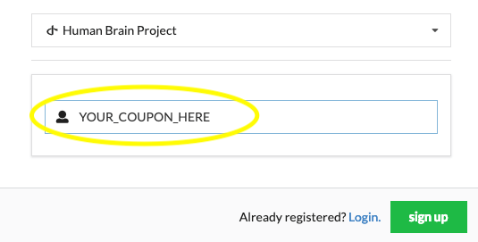
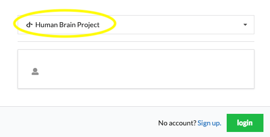
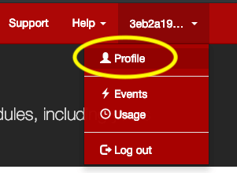
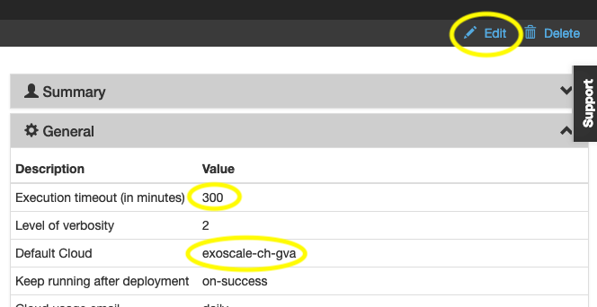

1) Go to [Nuvla](https://nuv.la)

2) Click on **Sign up** button

    

3) Enter the **coupon** that you have received in the coupon section

    

4) Enter your Human Brain Project authentication in the following page

    

5) When that is done you can **login** using HBP credentials

    

6) Let's go to edit your profile

    

7) Click the **edit** icon on top-right corner to modify the parameters
    - Set execution time to **300**
    - Make sure that your default cloud is set to **exoscale-ch-gva**

    
